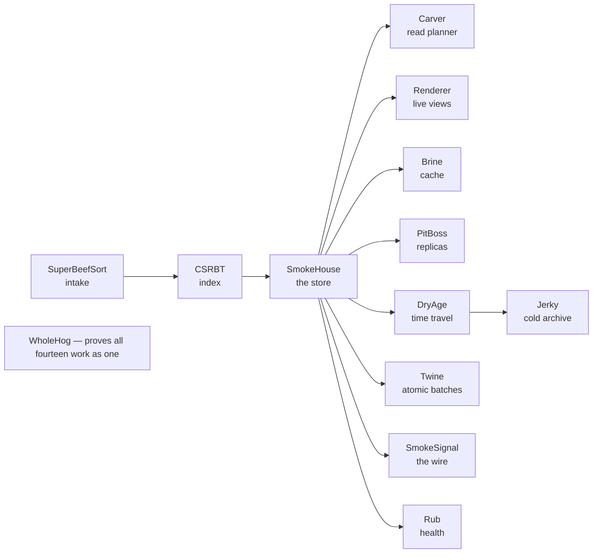

# The RicheyWorks ecosystem — start here

*A plain-English tour of what all this is, what you'd use it for, and how to run it — even if
you've never written a line of code.*

If you landed on one of these repositories (CSRBT, SmokeHouse, SmokeSignal, WholeHog… there are
fourteen of them) and thought *"…what is this, and what am I supposed to do with it?"* — this
page is for you. No jargon. Read the first two sections and you'll know whether it's for you.

---

## The short version

This is a **database, built from scratch, in fourteen small pieces.**

Not a database *app* you click around in — the *engine* underneath one: the part that actually
stores your information on disk, keeps it safe when the power goes out, keeps it sorted, and
answers questions about it quickly. Think of the machinery behind something like a to-do app, a
store's inventory system, or a bank ledger — the invisible engine, not the screen.

Most people never build this part. They use a ready-made one (names like SQLite, Postgres,
Redis). This project builds that whole machine from the ground up, on purpose, to understand
every piece — and each piece is its own self-contained engine with one job. Together they read
like a barbecue smokehouse (that's the running theme): meat comes in, gets sorted and seasoned,
smoked and preserved, aged, packed for the road, and there's a pit boss running the floor.

It's written in **Java**, it's **free and open-source** (MIT license), and every single piece is
tested to prove it does what it claims.

## Is this for you?

**Be honest with yourself about which one you are** — it saves everyone time.

- **"I'm curious what it is and how it was built."** Perfect — read this page, browse the
  pictures and the stories in each repo. You don't need to install anything.
- **"I'm learning to code and want to see how a real system is designed."** This is a goldmine.
  It's unusually well-documented, and every design decision is written down with the reasoning.
  Start with the developer quickstart below and run the live demo.
- **"I want to use this as the database for my app."** You *can*, but know what it is: a personal,
  research-grade engine — a labor of love and a learning tool — not a product with a support line.
  For a real production app most people should reach for an established database. Use this to
  *learn*, to *tinker*, or because you want to build on something hand-crafted.
- **"I don't really code and just want to poke at it."** Also fine! The last section shows you how
  to get an AI assistant to set it up and run the demo for you, step by step.

## The fourteen engines, in plain words

Each of these is its own repository. Here's what each one actually does, minus the jargon:

| # | Engine | In one sentence |
|---|--------|-----------------|
| 1 | [CSRBT](https://github.com/RicheyWorks/CSRBT) | Keeps your data sorted and fast to search — and quietly **rearranges its own internal shape** to match how you're actually using it. |
| 2 | [SuperBeefSort](https://github.com/RicheyWorks/SuperBeefSort) | A smart sorter: it **looks at your data first**, picks the fastest way to sort it, then does it. |
| 3 | [SmokeHouse](https://github.com/RicheyWorks/SmokeHouse) | The actual **store** — it writes everything down permanently, survives crashes, and can answer "what's the middle value?" or "the 90th‑percentile?" instantly. |
| 4 | [Carver](https://github.com/RicheyWorks/Carver) | The **planner** — given a question, it figures out the cheapest way to answer it (like a chess player thinking a move ahead). |
| 5 | [Renderer](https://github.com/RicheyWorks/Renderer) | Live **running totals** — counts, sums, "top 5 per city" — that keep themselves correct as the data changes, no manual recalculating. |
| 6 | [Brine](https://github.com/RicheyWorks/Brine) | A **memory cache** that keeps the hottest items close at hand — and *evolves* which ones to keep based on real usage. |
| 7 | [PitBoss](https://github.com/RicheyWorks/PitBoss) | The **floor manager** — keeps backup copies in sync and runs the safe hand‑off if the main copy goes down. |
| 8 | [DryAge](https://github.com/RicheyWorks/DryAge) | **Time travel** — take snapshots and later ask "show me the data exactly as it was back then," down to the individual change. |
| 9 | [Twine](https://github.com/RicheyWorks/Twine) | Bundles several writes into **one all‑or‑nothing change** that survives a crash — either all of it happened, or none of it did. |
| 10 | [SmokeSignal](https://github.com/RicheyWorks/SmokeSignal) | A **doorway** so another program on the same computer can talk to the store over a connection. |
| 11 | [Jerky](https://github.com/RicheyWorks/Jerky) | **Backups for the road** — squeezes a backup down small and checks it's not corrupted, for long‑term cold storage. |
| 12 | [WholeHog](https://github.com/RicheyWorks/WholeHog) | The **showcase** — wires all the engines together at once and proves they work as one system. Has a one‑command live demo. |
| 13 | [Rub](https://github.com/RicheyWorks/Rub) | The **health readout** — how many items, how many writes, how much wasted space, all at a glance. |
| 14 | [Sizzle](https://github.com/RicheyWorks/Sizzle) | The **stress tester** — deliberately crashes things at exact moments to *prove* the recovery actually works. |

**If you only open one repo, open [WholeHog](https://github.com/RicheyWorks/WholeHog)** — it's the
one that puts everything together and has the runnable demo.

## How the pieces connect

Data comes in through the sorter, gets ordered by the index, and lands in the store. From there,
every other engine is a consumer that *reads* the store — planning queries, keeping live totals,
caching, replicating, time-traveling, archiving, or watching its health. WholeHog is the proof that
all fourteen cooperate.



## What could someone build with it?

To make it concrete — the kinds of things this engine is the *foundation* for:

- A **crash-proof notes or journaling app** that never loses your work, and can pull back any
  earlier version of a note.
- A **small shop's inventory & point of sale** that answers "what were my top sellers last
  Tuesday?" and shows the books exactly as they stood on any past day.
- A **live game leaderboard** that stays ranked — top-10, your rank, percentiles — as scores flood in.
- A **personal finance ledger** where a multi-account transaction is all-or-nothing and every past
  balance is recoverable.
- A **sensor / IoT logger** that swallows a high volume of readings and rolls them into live
  averages, with backup copies kept in sync.
- A **local-first app backend** — a real database engine entirely on one machine, no cloud.
- An **audit or compliance trail** that's append-only, integrity-checked, and replayable to any moment.
- A **learning lab** for how databases actually work — run it, read the reasoning, crash it, watch it recover.
- A **field-ecology teaching & analysis lab** — diversity indices, survivorship curves, quadrat
  dispersion, genetics — that also narrates *your own* field data, right in the browser, with no install.

You'd write the app *on top* of these engines. They're the trustworthy floor; the app is the house
you build on it.

**Want the details?** [**USE-CASES.md**](USE-CASES.md) takes each of these apart — what it needs,
which engines carry it, and a short sketch of how they fit together.

---

## How to run it — even if you don't code

Here's the honest truth: this is a developer project, so "running it" means installing a couple of
free tools and typing a command or two. That sounds scary if you've never done it. **The easiest
path today is to let an AI assistant walk you through it** — or follow the step-by-step
**[QUICKSTART.md](QUICKSTART.md)** (about ten minutes, with exactly what you'll see when it works).
Here's the short version.

### The easy way: have an AI set it up with you

1. Open **[Claude](https://claude.ai)** (or ChatGPT, or any AI assistant).
2. Copy and paste this, filling in your computer type:

   > *"I'd like to try an open-source project from GitHub called `RicheyWorks/WholeHog`. I've
   > never installed a coding project before. I'm on **Windows** (or **Mac**). Please walk me
   > through it one step at a time — installing Java 17, downloading the project and the other
   > repos it needs, and running its demo — and wait for me to finish each step before the next.
   > Keep it simple and tell me what I should see if it worked."*

3. Follow along. When something doesn't look right, paste the exact message you see back to the
   assistant and it'll help you fix it. That's the whole trick — you don't need to understand the
   commands, you just need to run them and report back.

If you have the Claude desktop app, you can go further: ask it to *do* the setup on your computer
for you, not just tell you how.

### What "success" looks like

The showcase engine, WholeHog, has a one-line demo. When it's set up, running it prints a live
readout of the whole system standing up, doing work, and reporting its own health — proof that all
fourteen engines are cooperating. That's the payoff moment.

### The manual path (for the curious)

If you'd rather do it yourself, the whole thing needs:

- **Java 17 or newer** (free — [Adoptium](https://adoptium.net/) is the easy installer).
- **Git** (free — to download the code).
- The repositories **cloned side by side in one folder** (they're designed to find each other as
  siblings). At minimum, for the full showcase, clone all fourteen into the same parent folder.

Then, inside the `WholeHog` folder:

```bash
./gradlew run       # the live demo: stands the whole system up and prints its vitals
./gradlew build     # runs every test — proof it all works
```

(`gradlew` is a little build helper that ships *with* the project — it fetches everything else it
needs. On Windows it's `gradlew.bat`.)

## For developers

Every engine is a standalone Java library (Gradle 9.5.1 wrapper bundled, JDK 17 toolchain),
wired together by **nested Gradle composite builds** — clone the repos as siblings and each build
resolves the others from live source, no publishing step needed. Dependencies between engines
resolve by name, not pinned version, so they evolve independently.

The house discipline, if you're reading the code: every fix is **probe-verified** (the defect is
shown failing before the fix and passing after); performance claims are **pre-registered,
measured experiments** with a written verdict, never adjectives; tests assert *structural* truths
against a simple oracle (usually a `TreeMap`) so they can't flake on timing; and every honest
limitation is stated out loud in the docs rather than hidden. Start at
[WholeHog](https://github.com/RicheyWorks/WholeHog) — it composes all fourteen and tests them as
one organism — and each repo's own README goes deep on that engine.

## License & credit

MIT licensed — free to use, change, and build on. © 2026 Richmond (RicheyWorks). Built one engine
at a time, as a study in doing systems work honestly.
